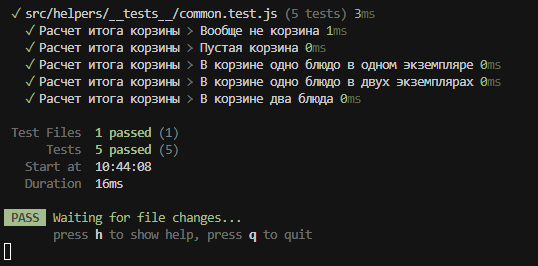

# restaurant1

## src/helpers/common.js
```javascript
export function calcItog(cartList) {
    if (Array.isArray(cartList) && cartList.length) {
      return cartList.reduce((total, item) => {
        return total + item.price * item.quantity;
      }, 0);
    }
    return 0;
  }
```

## src/helpers/__tests__/common.test.js
```javascript
import { describe, expect, test } from 'vitest';
import { calcItog } from '../common.js';

const item100_1 = { price: 100, quantity: 1 };
const item50_2 = { price: 50, quantity: 2 };

describe('Расчет итога корзины', () => {
    test('Вообще не корзина', () => {
      expect(calcItog(null)).toBe(0);
    });
  
    test('Пустая корзина', () => {
      expect(calcItog([])).toBe(0);
    });
  
    test('В корзине одно блюдо в одном экземпляре', () => {
      const cart = [item100_1];
      expect(calcItog(cart)).toBe(100);
    });
  
    test('В корзине одно блюдо в двух экземплярах', () => {
      const cart = [item50_2];
      expect(calcItog(cart)).toBe(100);
    });
  
    test('В корзине два блюда', () => {
      const cart = [item100_1, item50_2];
      expect(calcItog(cart)).toBe(200);
    });
});
```

## src/components/Cart.vue
```vue
<template>
  <div>
    Итого: {{ itog }}
  </div>
</template>

<script>
import { computed, ref } from 'vue';
import { calcItog } from '../helpers/common.js';

export default {
  setup() {
    const cartList = ref([]); 

    const itog = computed(() => {
      return calcItog(cartList.value);
    });

    return { itog, cartList };
  }
};
</script>
```





P.S. Почему-то саму папку restaurant коммитит как подмодуль и ее нельзя открыть. Несколько раз пробовал по разному запушить и все равно получилось то, что получилось. Потом исправлю если получится
